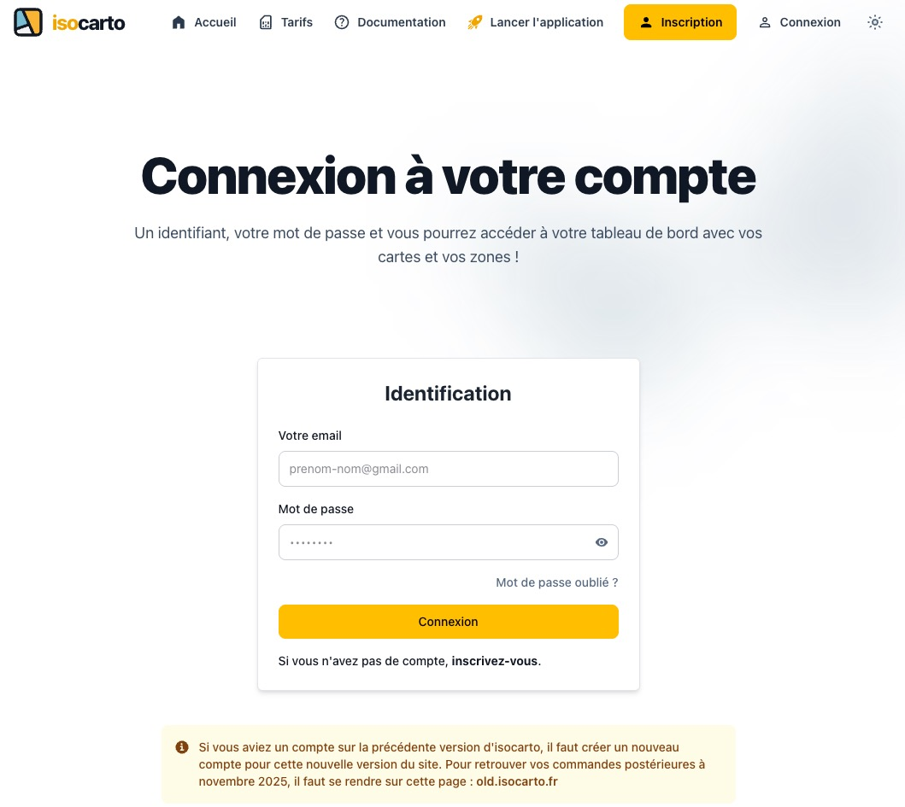

# Connexion à votre compte

Cette page explique comment vous connecter à votre compte sur **Isocarto**.

## Étape 1 : Accéder au formulaire de connexion

En haut à droite de la page d'accueil, cliquez sur le **bouton "Connexion"**. Vous serez redirigé vers le formulaire de connexion.

## Étape 2 : Renseigner vos identifiants

Saisissez votre **adresse email** et votre **mot de passe** dans les champs prévus.

- Vous pouvez **visualiser votre mot de passe** en cliquant sur l’icône en forme d’œil, située à côté du champ du mot de passe.

## Étape 3 : Mot de passe oublié

Si vous avez oublié votre mot de passe, cliquez sur le lien **"Mot de passe oublié ?"** pour lancer la procédure de réinitialisation. Suivez les instructions envoyées à votre adresse email.

## Étape 4 : Se connecter

Après avoir complété les champs, cliquez sur le bouton **"Se connecter"**. Si vos identifiants sont corrects, vous serez dirigé vers la page du **tableau de bord** de l’application.

---

Votre compte est maintenant prêt et vous pouvez utiliser Isocarto sans souci.
