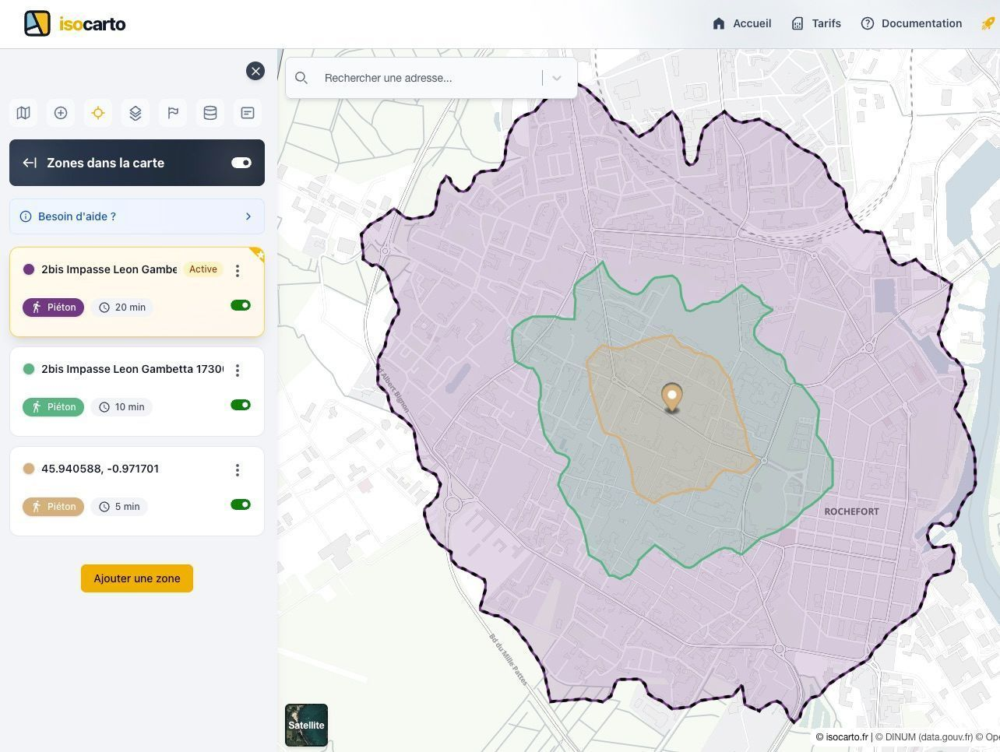

# Zones de Chalandise : Primaire, Secondaire et Tertiaire

Les zones de chalandise sont des outils essentiels en géomarketing pour analyser la proximité et l’attractivité d’un point de vente. Elles se divisent généralement en trois catégories : primaire, secondaire et tertiaire.

## Zone de Chalandise Primaire

La zone de chalandise primaire correspond à la zone géographique la plus proche du point de vente. Elle regroupe les clients qui se rendent le plus fréquemment dans le magasin, généralement dans un rayon de quelques minutes à pied ou en voiture.

### Caractéristiques principales

- **Proximité immédiate** : clients résidant à moins de 5 à 10 minutes du magasin.
- **Fidélité élevée** : les clients sont souvent des habitués.
- **Volume de ventes** : représente la majorité du chiffre d'affaires.

## Zone de Chalandise Secondaire

La zone de chalandise secondaire englobe les clients qui se déplacent un peu plus loin, mais qui visitent le point de vente de façon régulière. Elle s’étend généralement sur un rayon plus large que la zone primaire.

### Caractéristiques principales

- **Proximité modérée** : clients résidant à 10 à 20 minutes du magasin.
- **Fréquence de visite** : moins fréquente que la zone primaire, mais régulière.
- **Potentiel de croissance** : possibilité d’attirer de nouveaux clients.

## Zone de Chalandise Tertiaire

La zone de chalandise tertiaire regroupe les clients qui se déplacent sur de plus longues distances. Ils représentent une clientèle plus occasionnelle, souvent attirée par des caractéristiques spécifiques du point de vente.

### Caractéristiques principales

- **Proximité éloignée** : clients venant de 20 minutes à plusieurs dizaines de minutes du magasin.
- **Fréquence de visite** : moins fréquente, souvent liée à des besoins spécifiques.
- **Dépendance aux campagnes marketing** : influence importante des promotions et de la communication.

---

En comprenant ces trois zones, il est possible d’optimiser la stratégie commerciale et de mieux cibler les actions marketing pour chaque segment de clientèle.
