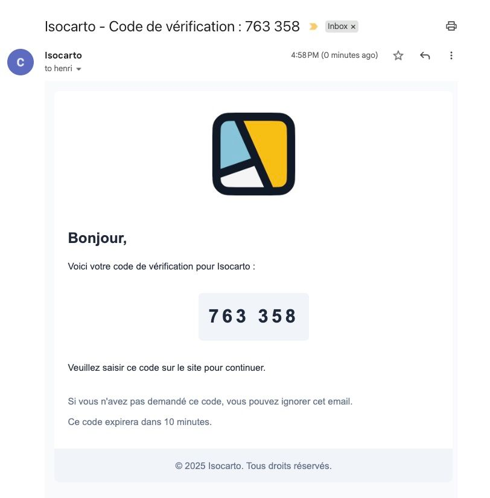

# Inscription sur le site

Cette page explique en détail comment créer votre compte sur **Isocarto**, votre plateforme de cartographie avancée.

## Étape 1 : Accéder au formulaire d'inscription

En haut de la page d'accueil, cliquez sur le **bouton jaune "Inscription"**. Vous serez redirigé vers le formulaire dédié à la création de compte. Vous pouvez aussi accéder au formulaire directement via l'URL <a href="https://isocarto.fr/auth/signup" target="_blank" rel="noopener noreferrer">https://isocarto.fr/auth/signup</a>

## Étape 2 : Compléter les informations personnelles

Renseignez les champs suivants :

- **Nom**
- **Prénom**
- **Adresse email** (veillez à utiliser une adresse valide, nécessaire pour la vérification)
- **Mot de passe** : l’interface affiche automatiquement un indicateur de niveau de sécurité pour vous aider à choisir un mot de passe robuste. Le mot de passe doit faire au minimum **8 caractères**.

:::tip

- Afin de sécuriser votre compte pensez à ajouter des chiffres, des majuscules et des caractères spéciaux.
- Par ailleurs un bon moyen d'avoir des mots de passe sécurisés et d'utiliser des gestionnaires de mots de passe comme <a href="https://bitwarden.eu/" target="_blank" rel="noopener noreferrer">Bitwarden</a>.
  :::

## Étape 3 : Fournir votre adresse

Votre **adresse postale** est requise, car elle sera utilisée pour la **facturation**, notamment si vous souscrivez à un abonnement.

## Étape 4 : Choisir votre profil

Sélectionnez l’un des profils suivants :

- **Professionnel**
- **Particulier**
- **Étudiant**

Ce choix nous permet d’adapter l’accompagnement en fonction de votre catégorie d’utilisateur.

### Informations supplémentaires pour les professionnels

Si vous choisissez le profil **Professionnel**, deux champs supplémentaires apparaîtront :

- **Nom de la société**
- **Numéro de TVA intracommunautaire** (si applicable)

Ils sont utiles pour établir vos factures correctement.

## Étape 5 : Valider votre inscription

Une fois le formulaire complété, cliquez sur **Valider**.

## Étape 6 : Vérification par code à 6 chiffres

Un **code de vérification à 6 chiffres** est automatiquement envoyé à l’adresse email fournie.

Saisissez ce code dans le champ prévu pour confirmer et finaliser votre inscription.

---

Votre compte est maintenant prêt ! Vous pouvez vous connecter et commencer à utiliser Isocarto.
