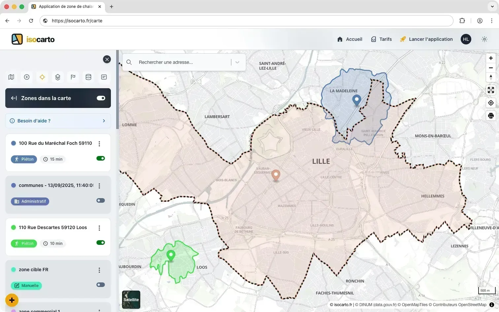

# Bienvenue sur Isocarto

Bienvenue dans la documentation d'**Isocarto**, la plateforme de géo-marketing nouvelle génération.

## Qu'est-ce qu'Isocarto ?

Isocarto est un outil de géo-marketing qui vous permet de :

- Créer des zones géographiques personnalisées
- Analyser vos territoires en profondeur
- Utiliser l'IA pour synthétiser vos données
- Prendre des décisions stratégiques basées sur la localisation

## Démarrage rapide

Suivez ces étapes pour commencer avec Isocarto :

1. [Créer votre premier projet](./guide-demarrage/premier-projet)
2. [Définir vos zones géographiques](./fonctionnalites/creation-zones)
3. [Analyser avec l'IA](./fonctionnalites/analyse-ia)

## Besoin d'aide ?

Consultez notre [FAQ](./faq) ou contactez notre support à [support@isocarto.fr](mailto:support@isocarto.fr)
