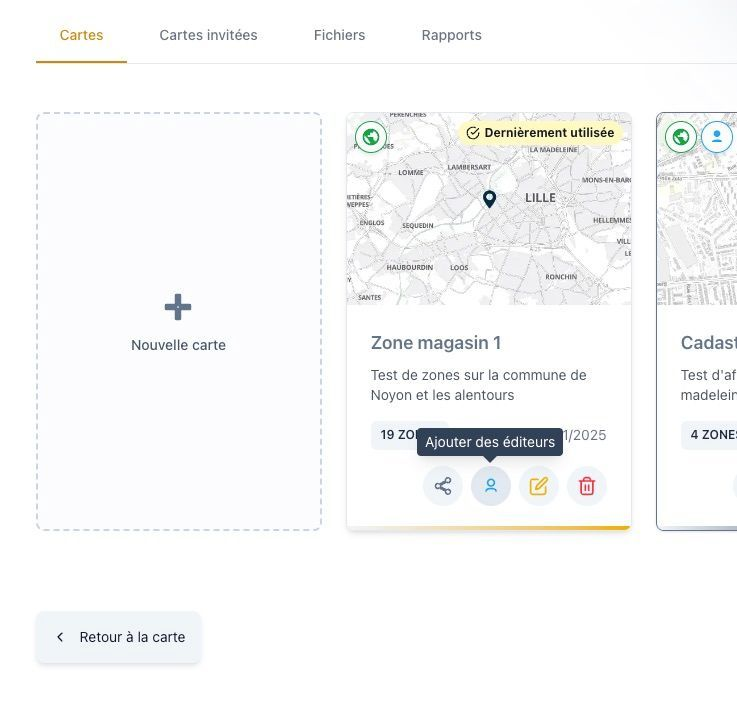
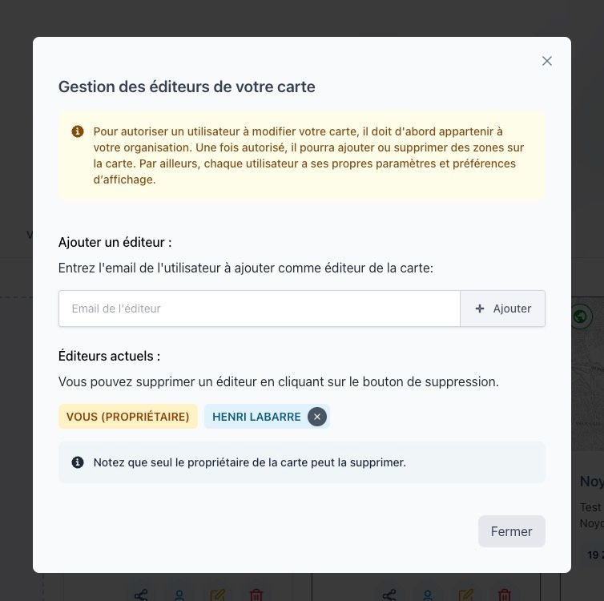

# Ajouter des éditeurs à une carte

Dans **Isocarto**, il est possible de travailler à plusieurs sur une même carte grâce à l’ajout d’**éditeurs**.  
Un éditeur est un utilisateur autorisé à **modifier la carte**, ajouter ou supprimer des zones, et utiliser toutes les fonctionnalités associées.

Chaque éditeur possède ses **propres paramètres et préférences d’affichage**, ce qui permet une collaboration efficace tout en conservant un environnement de travail personnalisé.

## Étape 1 : Accéder à la gestion des éditeurs

Dans l’onglet **Vos cartes**, sélectionnez la carte sur laquelle vous souhaitez collaborer.  
Cliquez ensuite sur le **bouton “Ajouter des éditeurs”** pour ouvrir le panneau dédié.

## Étape 2 : Ajouter un éditeur

Dans le panneau des éditeurs :

- Saisissez l’**adresse e-mail** de la personne que vous souhaitez ajouter,
- puis cliquez sur **Ajouter**.

:::warning[Condition importante]

**L’utilisateur ajouté doit obligatoirement appartenir à la même organisation** que le propriétaire de la carte. Cet utilisateur doit donc avoir été ajouté par le propriétaire de l’organisation.
Si ce n’est pas le cas, l’ajout est refusé.
:::

## Étape 3 : Gestion des éditeurs

Une fois ajoutés, les éditeurs apparaissent dans la liste.  
Vous pouvez :

- vérifier leur statut,
- les retirer si nécessaire,
- ou ajouter de nouveaux collaborateurs à tout moment.

---

Vous travaillez désormais en collaboration sur votre carte dans **Isocarto**, chacun avec ses propres préférences d’affichage tout en partageant les mêmes données.
