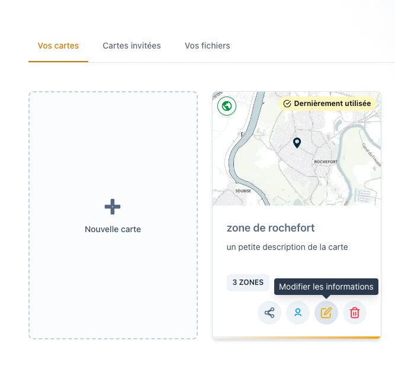
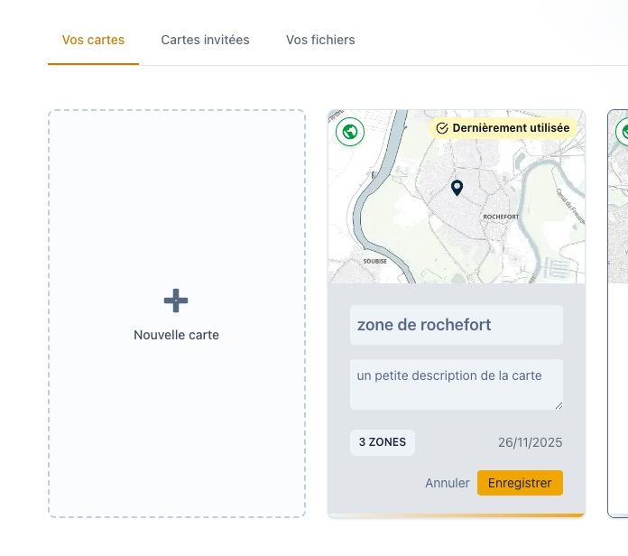

# Modifier le titre et la description

Cette page explique comment mettre à jour le **titre** et la **description** d’une carte dans **Isocarto**.

## Étape 1 : Accéder à la modification

Dans la page **Vos cartes**, sélectionnez la carte à modifier et cliquez sur le **bouton jaune** associé.  
Ce bouton vous permet d’ouvrir l’interface de modification des informations de la carte.

## Étape 2 : Mettre à jour les informations

Vous pouvez maintenant :

- modifier le **titre** de la carte,
- ajouter ou mettre à jour sa **description**, afin de préciser son objectif ou son contexte d’utilisation.

## Étape 3 : Enregistrer ou annuler

Une fois vos modifications faites, deux choix s'offrent à vous :

- Cliquez sur **Enregistrer** pour valider les changements,
- ou cliquez sur **Annuler** si vous ne souhaitez pas conserver les modifications.

---

Votre carte est maintenant mise à jour avec les nouvelles informations dans Isocarto.
