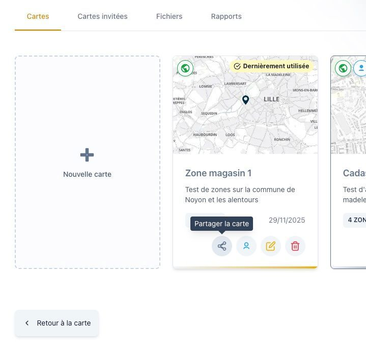
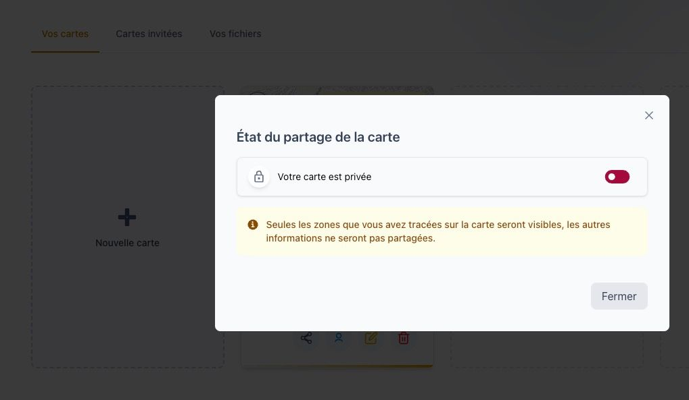
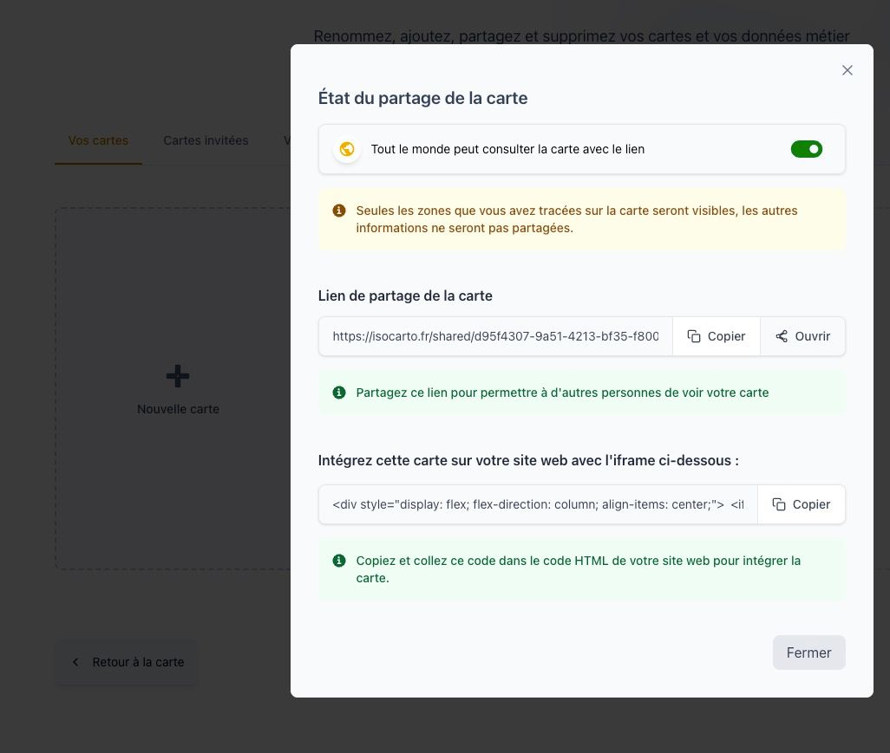

# Partager une carte

Par défaut, une carte dans **Isocarto** est **privée** et uniquement visible par vous. Pour la rendre accessible à d'autres personnes, vous devez activer le partage public.

## Étape 1 : Accéder à la fonction de partage

Dans la page **Vos cartes**, sélectionnez la carte que vous souhaitez partager et cliquez sur le **bouton de partage**.  
Ce bouton ouvre l’interface de partage public.

## Étape 2 : Choisir le type de lien

Une fois le partage activé, vous pouvez choisir entre deux types de lien :

- **Lien direct** : envoyez ce lien par e-mail ou messagerie. Il permet de visualiser la carte avec uniquement les informations des zones.
- **Intégration sur un site web** : obtenez un code iFrame pour intégrer la carte directement dans une page web.

## Étape 3 : Copier le lien ou le code iFrame

- Pour un **lien direct**, copiez l’URL et partagez-la comme souhaité.
- Pour une **intégration iFrame**, copiez le code fourni et collez-le sur votre site web.

## Étape 4 : Annuler le partage d'une carte

- **Désactivez le partage** pour rendre la carte privée.

:::warning[Attention]

- Si vous désactivez le partage, et réactivez le partage, l'**adresse (url) de partage va changer**. Donc si vous avez intégré la carte sur un site web ou si vous avez déjà transmis l'url de partage de la carte, veuillez mettre à jour les liens ou intégrations concernées.
  :::

---

Votre carte est maintenant accessible publiquement selon le type de lien choisi dans **Isocarto**.
