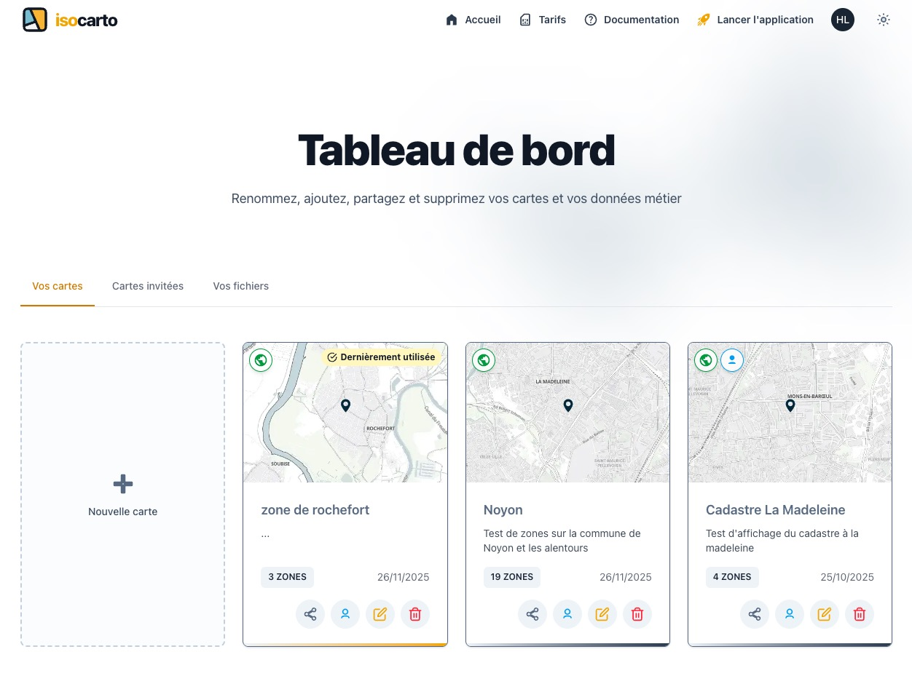

# Vos cartes

La page **Vos cartes** du tableau de bord vous permet de gérer l’ensemble des cartes que vous avez créées dans Isocarto. Chaque carte peut contenir plusieurs zones géographiques et peut être éditée ou partagée selon vos besoins.

## Consulter vos cartes

La liste de toutes vos cartes apparaît sous forme de cards, avec les informations essentielles telles que :

- Le **nom de la carte**
- Une **description**
- Le nombre de **zones** présentes dans la carte

## Ouvrir une carte

Cliquer sur une carte dans la liste pour l'ouvrir dans l'application.

## Ajouter une nouvelle carte

En cliquant sur **Ajouter une carte**, vous pouvez créer une nouvelle carte vide dans laquelle vous pourrez ensuite dessiner ou ajouter vos zones.

## Modifier une carte

Chaque carte propose plusieurs actions :

### Renommer la carte

Vous pouvez modifier le nom de la carte pour mieux refléter son contenu.

### Ajouter ou modifier une description

La description permet d’expliquer le contexte ou les objectifs liés à la carte.

### Éditer la carte

Le mode d’édition permet de :

- Ajouter des zones géographiques
- Modifier des zones existantes
- Ajuster les paramètres d’analyse
- Gérer les données associées à la carte

## Partage et collaboration

Isocarto permet la collaboration entre plusieurs utilisateurs.

### Partager une carte

Vous pouvez partager une carte avec d’autres personnes afin qu’elles puissent la visualiser.

### Ajouter des collaborateurs

Vous pouvez inviter d’autres utilisateurs à contribuer à la carte.  
Ils pourront modifier les zones, ajouter des données ou mettre à jour les paramètres selon leurs permissions.

## Supprimer une carte

Une carte peut être supprimée si elle n’est plus nécessaire.  
Une confirmation est toujours demandée pour éviter toute suppression accidentelle.

---

La page **Vos cartes** centralise toute la gestion de vos projets cartographiques, qu’ils soient personnels, professionnels ou collaboratifs.
