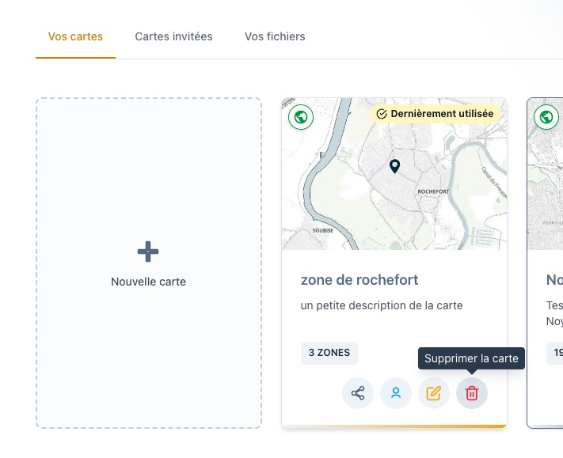
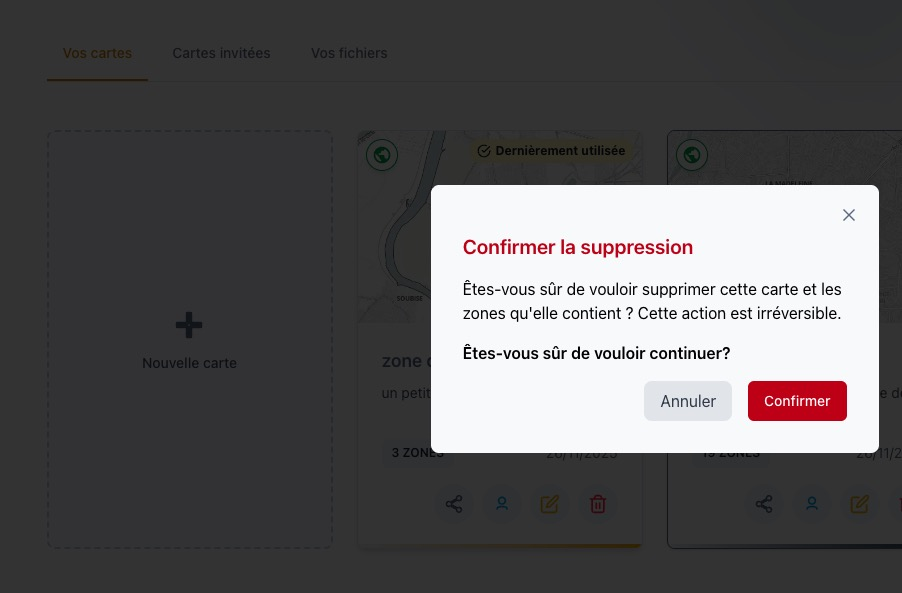

# Supprimer une carte

Cette page vous guide à travers les étapes pour supprimer une carte dans **Isocarto**.

## Étape 1 : Accéder à la suppression

Dans l’onglet **Vos cartes** de votre tableau de bord, repérez la carte que vous souhaitez supprimer. Cliquez sur l’**icône de la poubelle rouge** associée à cette carte.

## Étape 2 : Confirmation de la suppression

Une fenêtre de confirmation apparaîtra. Vous devrez alors valider votre choix pour confirmer la suppression de la carte.

## Étape 3 : Conséquences de la suppression

Il est important de noter que la suppression de la carte entraîne également la suppression définitive de toutes les zones géographiques qui y sont associées.

---

La carte est désormais définitivement supprimée de votre espace de travail Isocarto.
