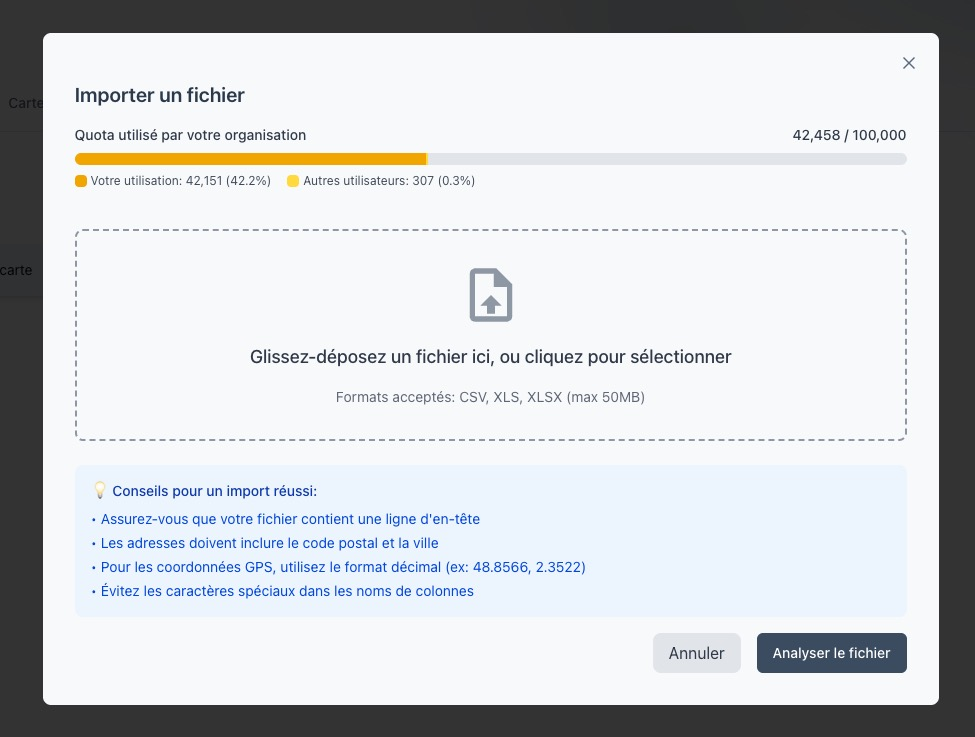
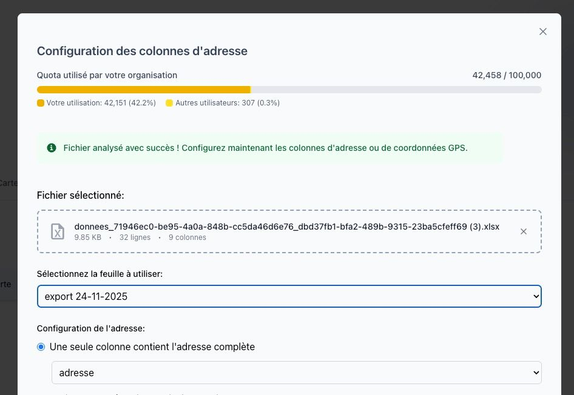
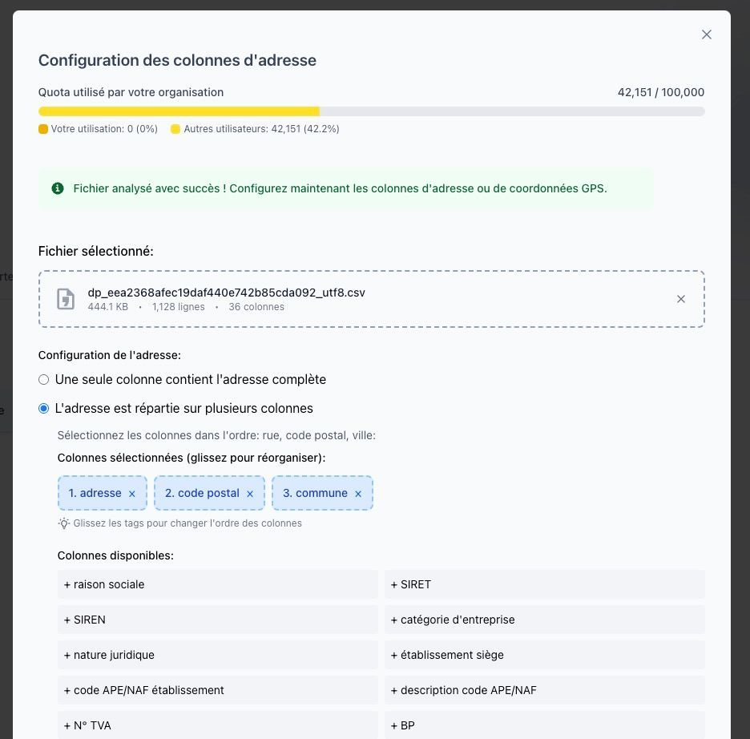
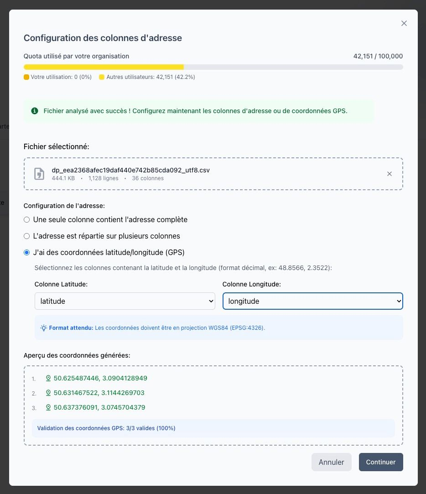
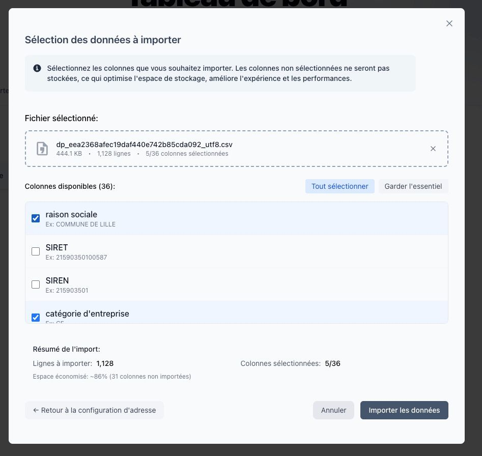

# Ajouter un fichier

Cette page explique comment importer un nouveau fichier de données dans **Isocarto**.

## Étape 1 : Choisir un fichier à importer

Depuis l’onglet **Vos fichiers**, cliquez sur **Ajouter un fichier**.

Vous pouvez ensuite importer les formats de fichier suivants :

- un fichier **CSV**,
- un fichier **XLSX**,
- un fichier **Excel (.xls)**.

:::info

Taille maximale des fichiers : 50 Mo par fichier
:::

## Étape 2 : Sélectionner la feuille (fichiers Excel)

Si vous importez un fichier Excel contenant plusieurs feuilles, sélectionnez celle qui contient vos données.

## Étape 3 : Choisir la méthode de géocodage du fichier

Trois configurations sont possibles :

### **1. Une colonne contient l'adresse complète**

Sélectionnez simplement la colonne contenant l’adresse.

### **2. L'adresse est répartie sur plusieurs colonnes**

Vous pouvez reconstituer une adresse postale en sélectionnant :

- la colonne **Adresse**,
- la colonne **Code postal**,
- la colonne **Ville**.

L’interface vous aide à associer correctement chaque champ.

### **3. Utilisation de coordonnées GPS**

Si votre fichier contient :

- une colonne **Latitude**,
- une colonne **Longitude**,

alors Isocarto les utilisera directement : **aucun géocodage n’est nécessaire**.

## Étape 4 : Sélectionner les données à importer

Toutes les colonnes ne sont pas utiles ou pertinentes.  
Vous pouvez donc sélectionner seulement celles que vous souhaitez importer.

- Les colonnes nécessaires au géocodage (adresse ou coordonnées GPS) sont **obligatoires**.
- Les autres colonnes sont **optionnelles**.

Cela permet de ne pas importer de données inutiles ou confidentielles.

## Étape 5 : Importer les données

Cliquez sur **Importer les données** pour lancer l’importation.  
Les données deviennent alors disponibles pour tous les membres de l’organisation.

---

Votre fichier est maintenant importé dans **Isocarto**.
